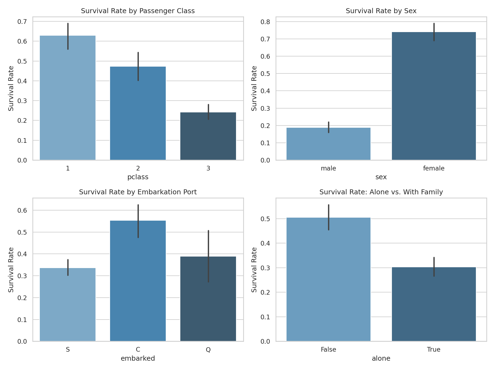
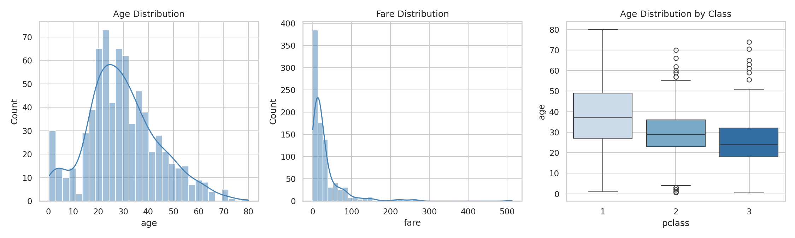
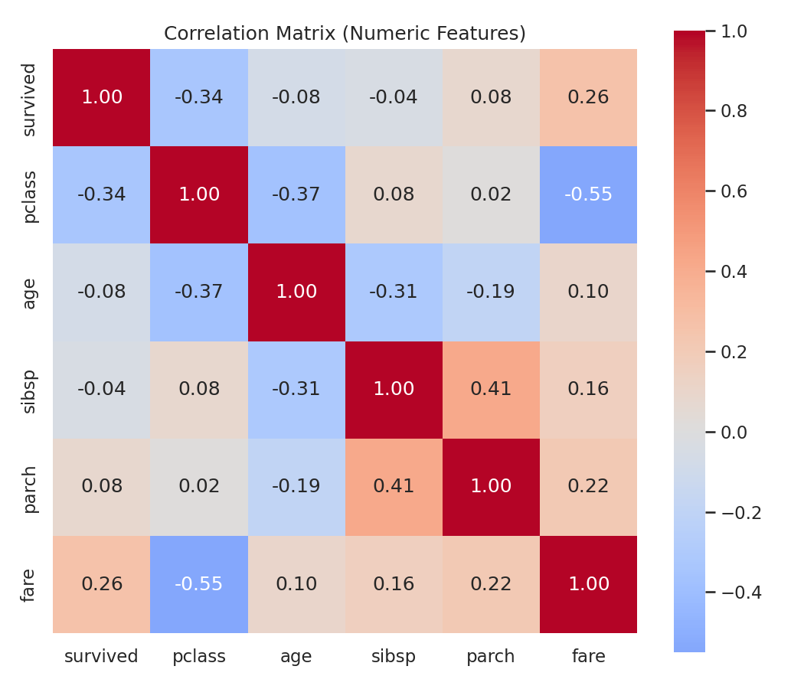
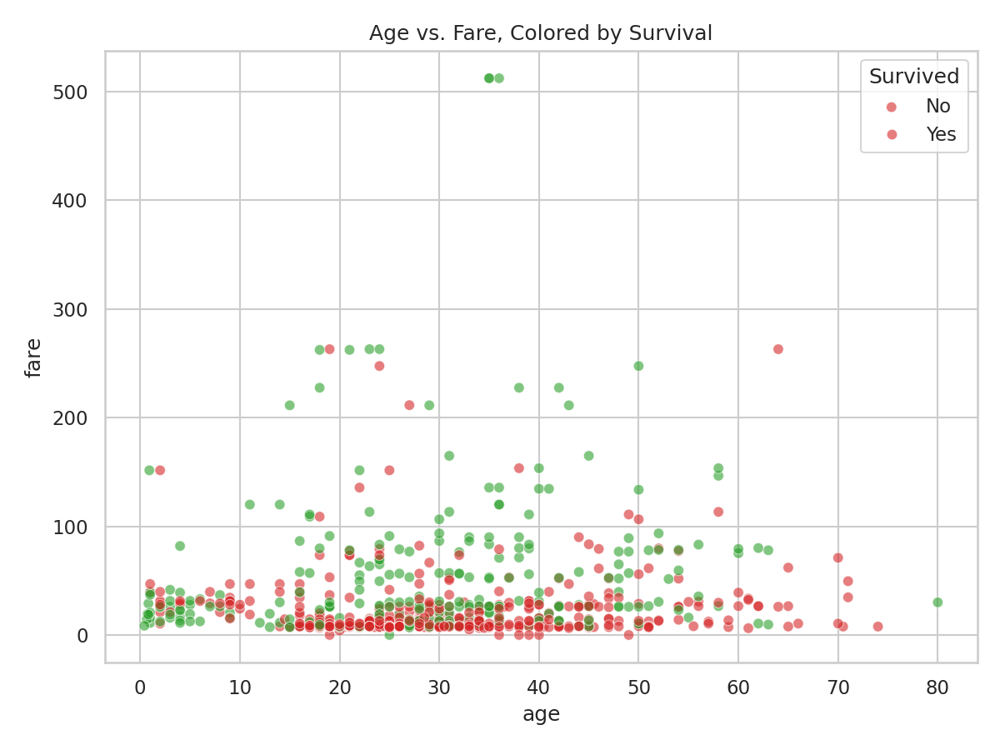

# Exploratory Data Analysis Report: Titanic Passenger Data

## 1. Overview

This report explores the Titanic passenger dataset (891 records, 15 variables) to understand what factors influenced survival. The analysis combines statistical summaries, distribution checks, and correlation analysis to surface the strongest patterns in the data.

## 2. Data Quality

Before analyzing patterns, we checked completeness:

| Column | Missing Count | Missing % |
|---|---|---|
| deck | 688 | 77.2% |
| age | 177 | 19.9% |
| embarked | 2 | 0.2% |
| embark_town | 2 | 0.2% |

**Takeaway:** `deck` is missing for the large majority of passengers and isn't reliable for analysis without imputation or exclusion. `age` has a moderate gap (~20%) that should be handled (e.g., median imputation by class) before it's used in modeling. The remaining fields are essentially complete.

## 3. Statistical Summary

Key numeric variables:

| Stat | Age | Fare | Siblings/Spouses | Parents/Children |
|---|---|---|---|---|
| Mean | 29.7 | $32.20 | 0.52 | 0.38 |
| Median | 28.0 | $14.45 | 0 | 0 |
| Std Dev | 14.5 | $49.69 | 1.10 | 0.81 |
| Max | 80.0 | $512.33 | 8 | 6 |

Fare is heavily right-skewed (mean $32 vs. median $14), meaning a small number of high-paying passengers pull the average up. Most passengers paid well under $32.

Passenger composition: 68% traveled in 2nd/3rd class, 65% were male, and 60% were traveling alone.

## 4. Key Visualizations

### 4.1 Survival Rate by Category

### 4.2 Distributions

### 4.3 Correlation Matrix

### 4.4 Age vs. Fare, by Survival

## 5. Key Influencing Factors

Ranking numeric correlation strength with survival:

| Factor | Correlation with Survival |
|---|---|
| Passenger class | -0.34 |
| Fare | +0.26 |
| Parents/children aboard | +0.08 |
| Age | -0.08 |
| Siblings/spouses aboard | -0.04 |

Beyond raw correlation, group survival rates reveal the sharpest patterns:

- **Sex is the single strongest predictor.** Women survived at 74.2%, men at only 18.9% — consistent with "women and children first" evacuation protocol.
- **Class mattered substantially.** 1st class: 63.0% survival, 2nd class: 47.3%, 3rd class: 24.2%. This tracks with cabin location and lifeboat access.
- **Fare correlates with class** (higher fare → higher class → better odds), which is why fare shows a positive correlation even though it's really a proxy for class and cabin location.
- **Traveling with family helped, to a point.** Passengers not traveling alone survived at 50.6% vs. 30.4% for solo travelers — likely reflecting that solo travelers were disproportionately male and in 3rd class.
- **Embarkation port shows a gap** (Cherbourg 55.4% vs. Southampton 33.7%) — but this is confounded by class, since Cherbourg passengers were disproportionately 1st class.
- **Age has a weak individual effect**, but the age-vs-fare scatter shows survivors cluster among younger, higher-fare passengers.

## 6. Conclusions

The dominant story in this dataset is that **sex and class (a proxy for wealth and physical location on the ship) explain most of the variance in survival**, far more than age or family size. Any predictive model built on this data should treat `sex` and `pclass` as primary features, with `fare`, `embarked`, and `alone` as secondary signals that partly duplicate the same underlying pattern (wealth and social position).

**Suggested next steps:**
- Impute or bucket missing `age` values (e.g., by class/title) before modeling
- Drop or heavily engineer `deck` given its sparsity
- Consider interaction terms (e.g., sex × class) for a predictive model, since the visualizations suggest these factors interact rather than act independently
