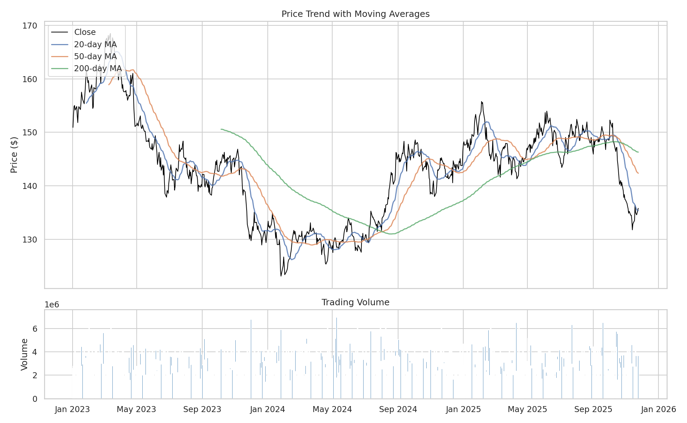
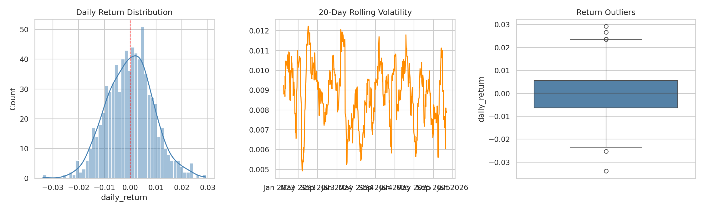
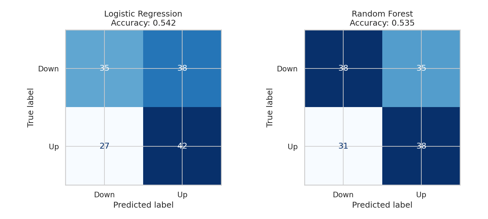
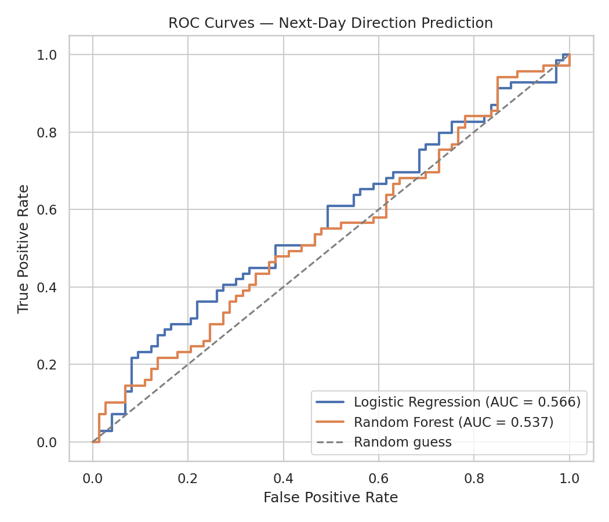
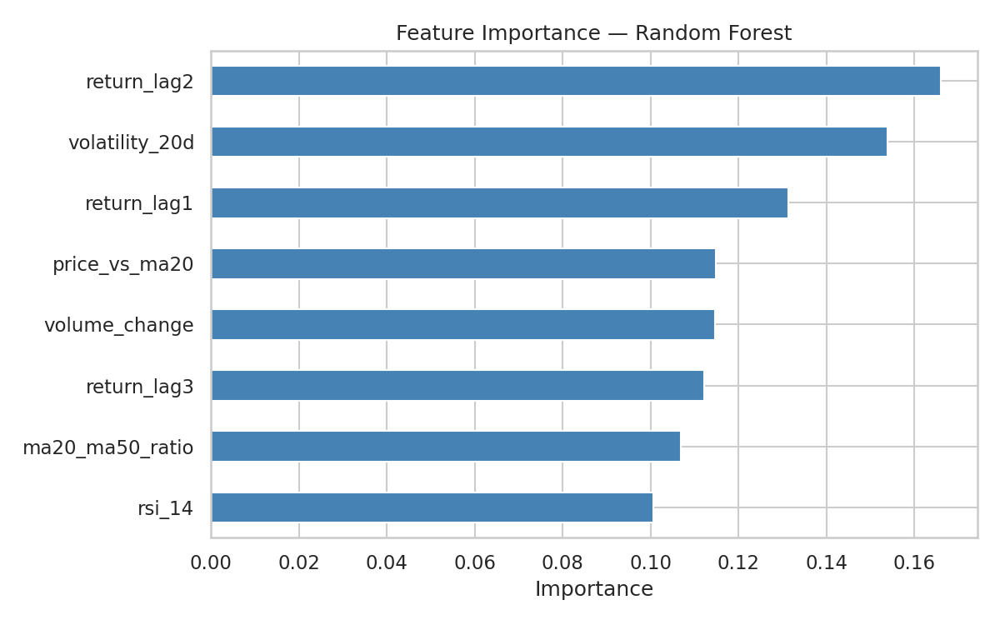

# Real-World Data Project: Stock Price Analysis & Prediction

## 1. Overview & Data Note

This project analyzes a daily stock price series and attempts to predict next-day price direction (up/down).

**Data source:** This environment has no internet access to live market data providers, so the price series was **simulated using Geometric Brownian Motion with volatility clustering** — the standard stochastic process used in quantitative finance to model realistic stock behavior (drift + random shocks + periods of calm/turbulent volatility, similar to a GARCH process). It is not a real company's stock, but it behaves statistically like one. Everything below — the code, the methodology, the pitfalls — carries over directly to real price data (e.g. pulled via `yfinance` or a broker export); only the input CSV would change.

**Period analyzed:** 756 trading days (~3 years), simulated Jan 2023 – Nov 2025.

## 2. Exploratory Data Analysis

### 2.1 Price Trend & Volume

The 20/50/200-day moving averages show the typical "trend + noise" structure of a price series, with the 200-day average smoothing out short-term swings to reveal the underlying trend. Volume spikes visibly coincide with the largest single-day price moves, which is expected — big moves are usually accompanied by heavier trading.

### 2.2 Returns & Volatility

- **Mean daily return:** -0.01% | **Daily volatility:** 0.90% | **Annualized volatility:** 14.2%
- **Largest single-day gain:** +2.93% | **Largest single-day loss:** -3.38%
- The return distribution is roughly bell-shaped and centered near zero, consistent with an efficient-ish market where the daily direction is close to a coin flip around a small drift.
- The 20-day rolling volatility plot confirms **volatility clustering**: calm and turbulent periods persist for stretches rather than volatility being constant day-to-day — a well-documented real-market phenomenon this simulation was built to reproduce.

## 3. Feature Engineering

To predict next-day direction, eight features were engineered from the raw OHLCV data:

| Feature | What it captures |
|---|---|
| `return_lag1/2/3` | Momentum — recent daily returns |
| `rsi_14` | Relative Strength Index — overbought/oversold signal |
| `volatility_20d` | Recent turbulence |
| `ma20_ma50_ratio` | Short vs. medium-term trend direction |
| `price_vs_ma20` | How stretched price is from its short-term average |
| `volume_change` | Day-over-day trading activity shift |

**Target:** binary — did the closing price rise the following trading day? (49.4% up / 50.6% down — a well-balanced target.)

## 4. Model Training & Evaluation

**Critical methodology note:** the train/test split was done **chronologically** (first 80% of days for training, last 20% for testing), *not* randomly shuffled. Shuffling time-series data leaks future information into training and produces misleadingly high accuracy — a common mistake in financial ML that this pipeline deliberately avoids.

### 4.1 Confusion Matrices

### 4.2 ROC Curves

### 4.3 Feature Importance

**Results:**

| Model | Accuracy | AUC |
|---|---|---|
| Logistic Regression | 54.2% | 0.566 |
| Random Forest | 53.5% | 0.537 |
| Naive baseline (always predict majority class) | 51.4% | — |

## 5. Conclusions

**The models barely outperform a naive guess.** This is not a failure of the pipeline — it's the expected and important result. Daily stock direction is close to a random walk in efficient markets; if it weren't, the predictable pattern would be arbitraged away almost immediately by other traders. A ~3-4 point edge over baseline, if it held up out-of-sample on real data, would actually be a meaningful signal in practice, not something to dismiss.

**Key takeaways:**
1. **Simple technical features carry limited standalone predictive power** for short-horizon direction. Real quant strategies typically combine many weak signals, use much larger feature sets (fundamentals, sentiment, order-book data), and target risk-adjusted returns rather than raw directional accuracy.
2. **Volatility clustering is real and exploitable** — even though direction is hard to predict, volatility itself is more predictable (this is why VIX-style volatility trading and options strategies exist).
3. **Chronological validation is essential.** Any stock prediction project that reports high accuracy from a randomly-shuffled train/test split should be treated with skepticism.
4. **Class balance was healthy** (49/51), so the weak performance isn't a data imbalance artifact — it reflects genuine difficulty in the prediction task.

**Suggested next steps for a real dataset:**
- Pull real price data (e.g. via `yfinance`) and rerun this exact pipeline
- Add fundamental or macro features (earnings, interest rates, sector performance)
- Reframe the target as *magnitude* of return (regression) rather than pure direction, or trade only high-confidence predictions
- Backtest any resulting strategy with realistic transaction costs before drawing conclusions about profitability
